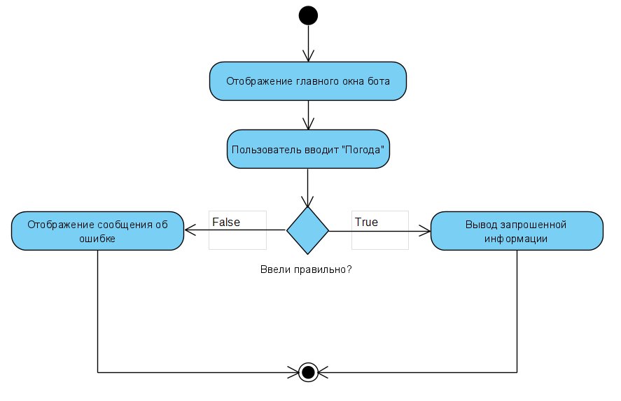
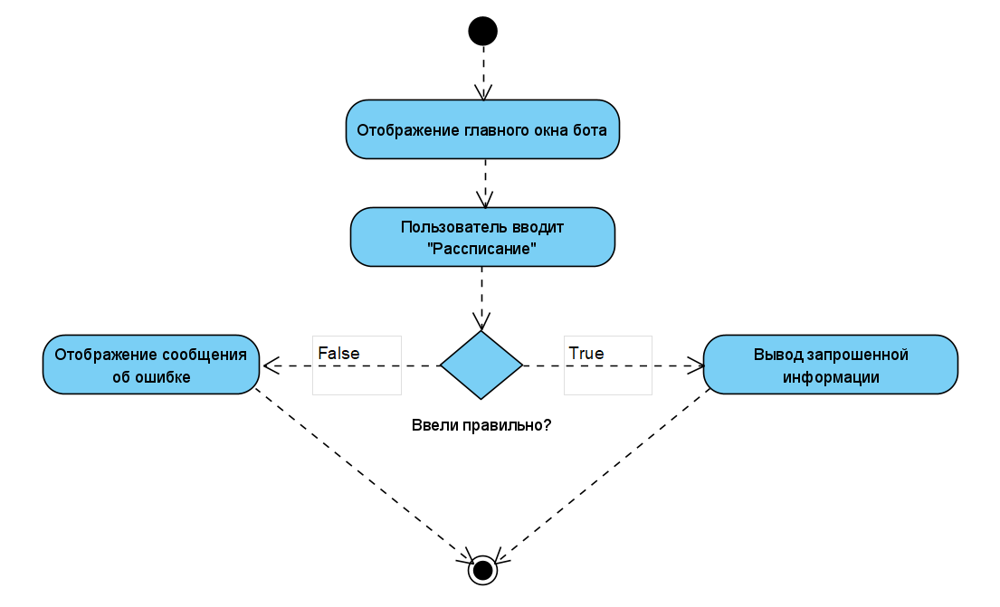
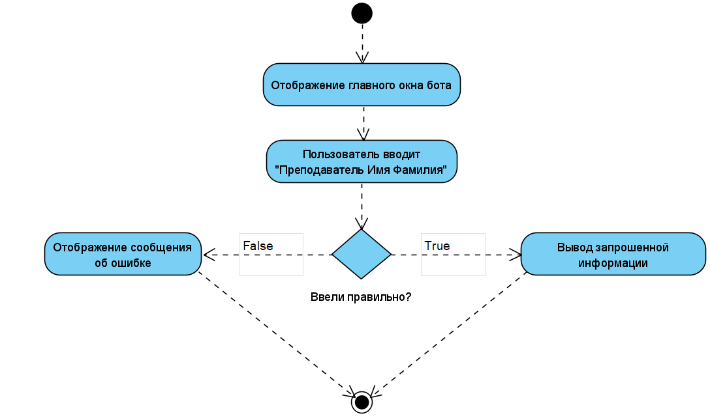

# Диаграммы деятельности

# Содержание
1. [Получение информации о погоде](#1)
2. [Получение информации о рассписании занятий](#2)
3. [Полученеи информации о преподавателе](#3)

## 1. Получене информации о погоде 
  После подключения Telegram-бота пользователь вводит команду "Погода", после чего бот выводит информацию, которую запросил пользователь. В случае неправильно введенной команды бот выведет сообщение об ошибке.
  
  
  
## 2. Получене информации о рассписании занятий 
  После подключения Telegram-бота пользователь вводит команду "Рассписание", после чего бот выводит информацию, которую запросил пользователь. В случае неправильно введенной команды бот выведет сообщение об ошибке.
  
  
  
## 3. Получене информации о погоде 
  После подключения Telegram-бота пользователь вводит команду "Преподаватель", после чего бот выводит информацию о запрошенном преподавателе. В случае неправильно введенной команды бот выведет сообщение об ошибке.
  
  
  
