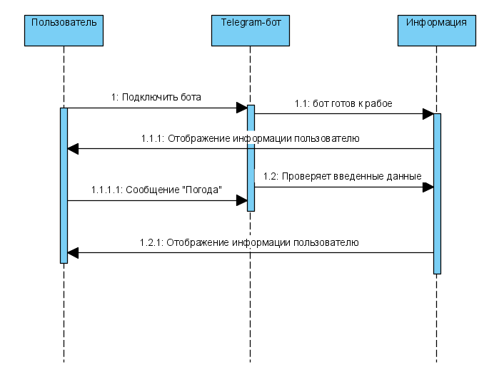
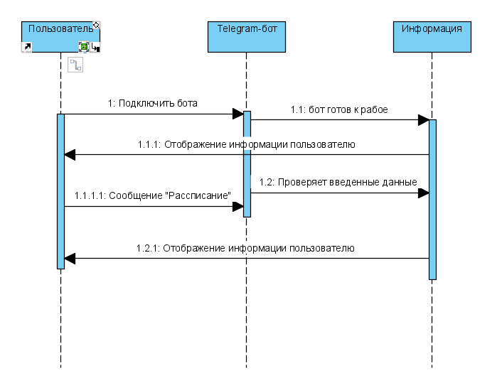
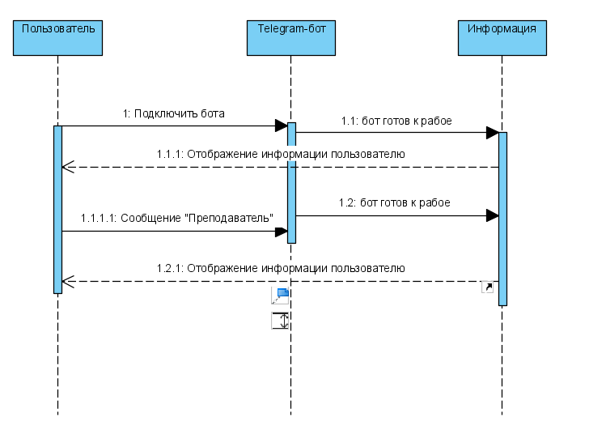

# Диаграммы последовательности

#Содержание
1. [Получение информации о погоде](#1)
2. [Получение информации о рассписании занятий](#2)
3. [Полученеи информации о преподавателе](#3)

## 1. Получение информации о погоде

## 2. Получение информации о рассписании занятий

## 3. Полученеи информации о преподавателе

