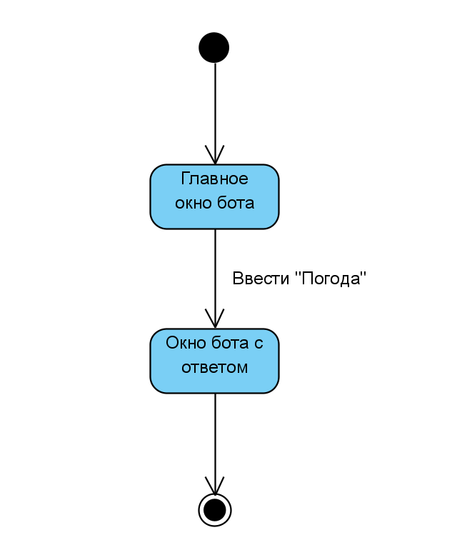
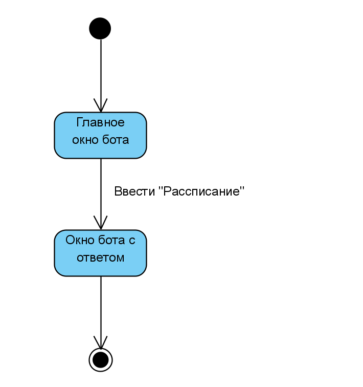
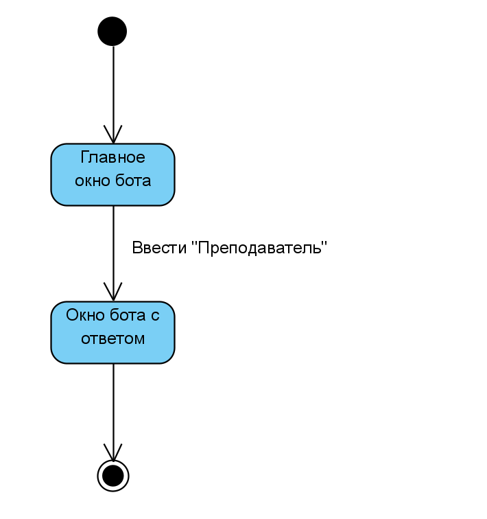

# Диаграммы состояний
---

#Содержание
1. [Получение информации о погоде](#1)
2. [Получение информации о рассписании](#2)
3. [Получение информации о преподавателе](#3)

## 1. Получение информации о погоде

## 2. Получение информации о рассписании

## 3. Получение информации о преподавателе

